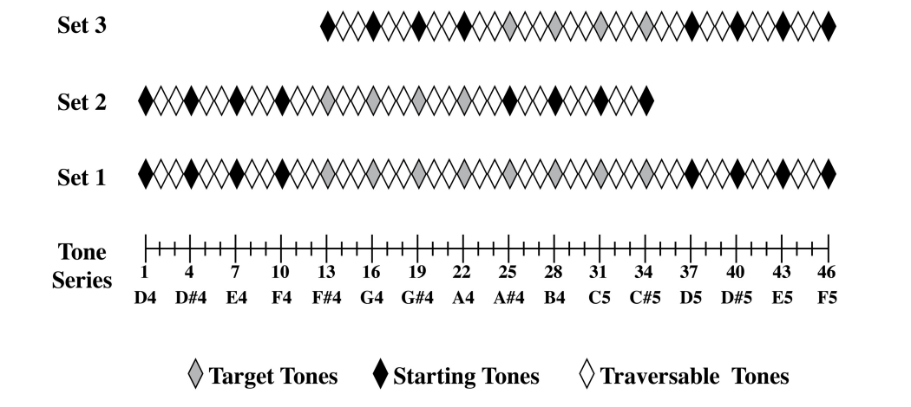

```{r, include = FALSE}
library("papaja")
library(tidyverse)
library(lattice)
library(magrittr)
r_refs("r-references.bib")
library(knitr)
library(ggpubr)
```


```{r setup, include = FALSE}
synthvowelslong <- read.csv("SynthVowels.csv")
synthwordslong <-read.csv("SynthWords.csv")

colnames(synthvowelslong)
synthvowelslong %>% select(Gesture:C14T) 
synthvowelsnew <- synthvowelslong %>%select(Gesture:C14T) 
colnames(synthwordslong)
synthwordslong %>% select(Gesture:C14T)
synthwordsnew <- synthwordslong %>% select(Gesture:C14T)
synthwordsnew %>% select(-c(High.Low.Probe))
synthwordsnew <-synthwordsnew %>% select(-c(High.Low.Probe))

synthvowels <- synthvowelsnew %>% 
  add_column(embedded = "False", .after = "C14T")
synthwords <- synthwordsnew %>%
  add_column(embedded = "True")

wordsandvowels <- rbind(synthvowels, synthwords)

contexteffects <- wordsandvowels %>% 
  mutate(Probe = case_when(PTPosition > 9 ~ "High", 
                             PTPosition <= 9 ~ "Low")) %>% 
  group_by(Subject, embedded, TTPosition, Probe) %>% 
  summarise(MeanPosDiff = mean(PositionDiff)) 
editedcontext <- read.csv("ContextKnowledgeVowelWords.csv")
```


(ref:GGPlotBoxplot) Boxplot of Speech Perception Differences Between Words and Vowels

``` {r, GGPlotBoxplot, fig.cap = "(ref:GGPlotBoxplot)"}
#graphs for my dataset 
ggplot(contexteffects, aes(Probe, MeanPosDiff, color = embedded)) + geom_boxplot() + xlab("Probe") + ylab("Mean Position Difference") 

```


(ref:GGPlotLine) Difference in Context Effects for Words and Vowels

```{r, GGPlotLine, fig.cap = "(ref:GGPlotLine)"}
ggline(contexteffects, "Probe", "MeanPosDiff", 
       linetype = "embedded", color = "embedded", add = "mean_se")
```


```{r fig-tonescale, fig.cap = "Diagram of Tones Used"}
#figure of tones 


```
As referenced in Table\ \@ref(tab:table-meanTTPosition) each subject was counterbalanced such that they received a mean trial tone position across all trials of 9.5 (which correlates to x note)

In Figure\ \@ref(fig:GGPlotBoxplot) we can see that the there was a difference in bias between participants identification of vowels versus words when given a high tone compared to a lower tone.

Whereas, we can see in Figure\ \@ref(fig:GGPlotLine) that a word or vowel (embedded versus non-embedded) effects the overall bias for the tones in a different way. For example, high probe tones for vowels embedded within a word have a higher bias than vowels themselves. 

The Figure\ \@ref(fig:fig-tonescale) represents the range of tones used in the experiment and the starting tones indicate the probe tones. 


```{r table-meanTTPosition}
mytable <- contexteffects %>%
  group_by(Subject) %>%
  summarize(
    mean.TTPosition = mean(TTPosition) 
  ) %>% apa_table()
mytable
```


# Methods
We based our methodology from our previous paper that examined auditory category knowledge within experts and novices. [^1] <!-- Auditory category knowledge in experts and novices (Heald, Van Hedger & Nusbaum, 2014; retrieved from https://www.frontiersin.org/articles/10.3389/fnins.2014.00260/full) -->

[^1]: Heald, S. L., Van Hedger, S. C., & Nusbaum, H. C. (2014). Auditory category knowledge in experts and novices. Frontiers in Neuroscience, 8, 260. 

```{r}

```
## Participants

## Material

## Procedure

## Data analysis


# Results

# Discussion


# References


